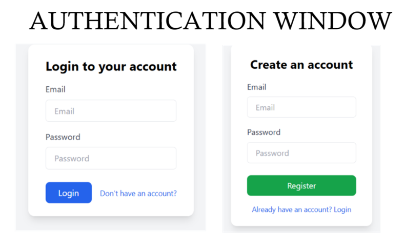
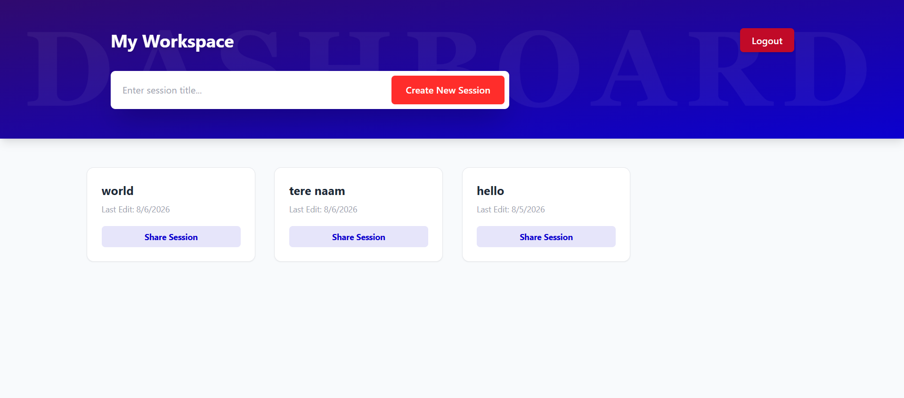
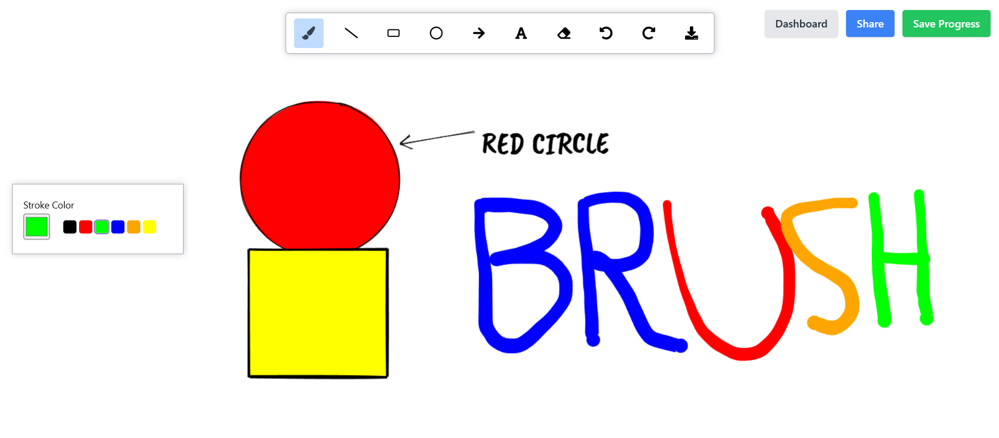
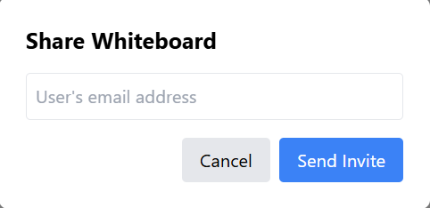

# WhiteBoard

WhiteBoard is a full-stack collaborative whiteboard application built with React, Express, MongoDB, and Socket.IO. It supports secure user accounts, session-based boards, real-time drawing, and board sharing.

## Features

- User authentication with register and login
- Private dashboard for managing whiteboard sessions
- Create and open multiple whiteboard sessions
- Real-time collaboration through Socket.IO
- Drawing tools for brush, line, rectangle, circle, arrow, eraser, and text
- Color selection and stroke controls
- Undo and redo support
- Session sharing with other users by email
- Protected routes for authenticated users only
- Persistent session storage in MongoDB

## Project Structure

- `backend/` - Express API, authentication, MongoDB models, and Socket.IO server
- `frontend/WhiteBoard/` - React client and whiteboard UI

## Requirements

- Node.js 18 or later
- npm
- MongoDB database

## Environment Variables

Create a `.env` file inside `backend/` with:

```env
MONGO_URI=your_mongodb_connection_string
JWT_SECRET=your_secret_key
BACKEND_PORT=5000
```

Create a `.env` file inside `frontend/WhiteBoard/` with:

```env
REACT_APP_API_URL=http://localhost:5000/api
```

## Installation

### 1. Clone the repository

```bash
git clone https://github.com/your-username/whiteBoardNew.git
cd whiteBoardNew
```

### 2. Install root dependencies

```bash
npm install
```

### 3. Install backend dependencies

```bash
cd backend
npm install
```

### 4. Install frontend dependencies

```bash
cd ../frontend/WhiteBoard
npm install
```

## Run the Project

### Option 1: Run both apps from the root

From the project root:

```bash
npm run dev
```

This starts:

- Backend on `http://localhost:5000`
- Frontend on `http://localhost:3000`

### Option 2: Run backend and frontend separately

Backend:

```bash
cd backend
npm start
```

Frontend:

```bash
cd frontend/WhiteBoard
npm start
```

## Usage

1. Register a new account or log in.
2. Open the dashboard and create a new whiteboard session.
3. Draw, erase, add shapes, and add text on the board.
4. Share the session with another user using their email address.
5. Collaborate in real time as changes sync across connected users.

## Screenshots

Add your project images below before publishing to GitHub.

| Preview | Description |
| --- | --- |
|  | Authentication view |
|  | Dashboard view |
|  | Whiteboard canvas |
|  | Share session modal |


## Deployment Notes

- Update `REACT_APP_API_URL` to point to your deployed backend.
- Restrict Socket.IO CORS origins before production deployment.
- Make sure MongoDB credentials and JWT secrets are stored securely in your hosting environment.

## Tech Stack

- React
- React Router
- Socket.IO
- Express
- MongoDB
- Mongoose
- Tailwind CSS

